# Architecture Documentation

Подробная документация по архитектуре ShoesBot.

## 📐 Общая Архитектура

ShoesBot состоит из двух основных компонентов:

1. **Telegram Bot** (`shoesbot/`) - Прием фото, обработка баркодов
2. **Django Web App** (`shoessite/`) - Управление карточками, AI генерация

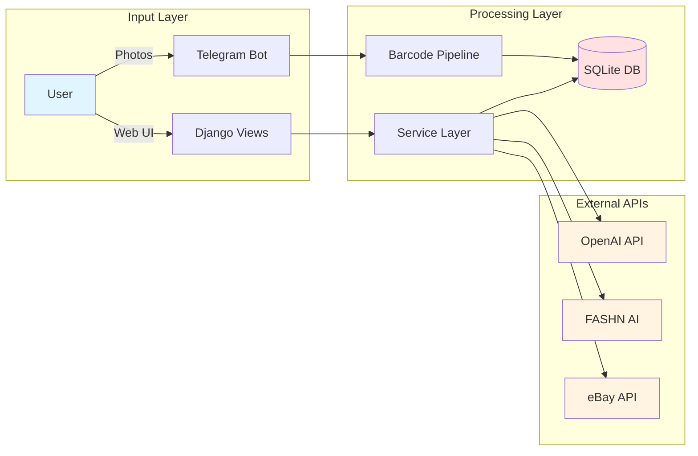

## 🤖 Telegram Bot Architecture

### Компоненты

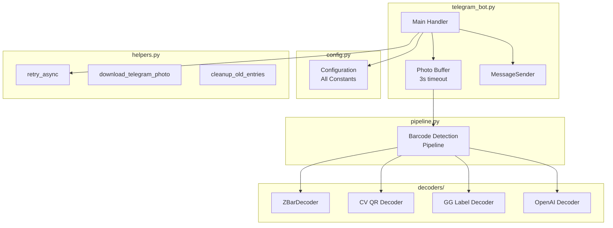

### Workflow

1. **Photo Reception**: User sends photos to bot
2. **Buffering**: Photos buffered for 3 seconds (await more photos)
3. **Barcode Detection**: Multi-decoder pipeline
4. **API Call**: POST to Django `/api/upload-batch/`
5. **Memory Cleanup**: Background task removes old entries every hour

### Configuration (`config.py`)

```python
@dataclass
class BotConfig:
    BUFFER_TIMEOUT: Final[float] = 3.0
    BUFFER_WAIT_TIME: Final[float] = 3.2
    MAX_RETRIES: Final[int] = 3
    RETRY_DELAYS: Final[tuple] = (0.5, 1.0, 2.0)
    PENDING_TTL_HOURS: Final[int] = 24
    SENT_BATCHES_TTL_HOURS: Final[int] = 48
```

### Barcode Pipeline

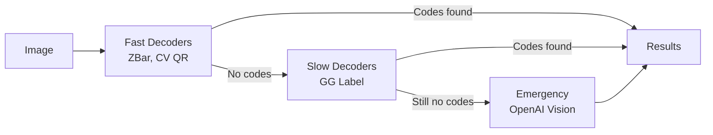

**Decoder Priority:**
1. **Fast**: ZBar (0.1-0.5s) - 13 types of barcodes
2. **Fast**: CV QR (0.1-0.3s) - QR codes
3. **Slow**: GG Label Improved (1-2s) - Yellow GG+Q labels
4. **Emergency**: OpenAI Vision (3-5s) - When all else fails

### GG+Q Label Detection Logic

```python
# Специальная логика для желтых лейблов
has_gg_text = len(gg_from_ocr) > 0  # "GG" текст найден?
has_q_code = len(gg_from_q) > 0      # Q баркод найден?
has_complete_pair = has_gg_text and has_q_code

if not has_complete_pair:
    # Запускаем emergency OpenAI если неполная пара
    logger.warning(f"Incomplete GG label pair detected")
```

## 🌐 Django Web Application

### Layered Architecture

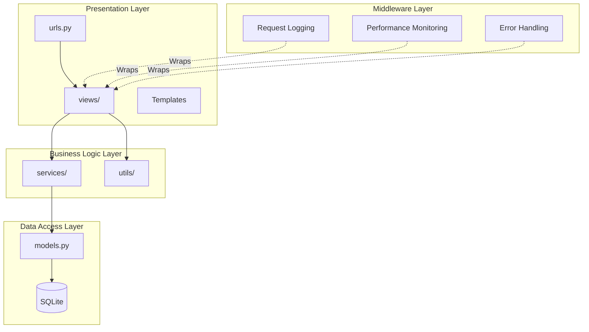

### Views Module Structure

**Before Refactoring**: `views.py` - 2758 lines

**After Refactoring**: 10 focused modules

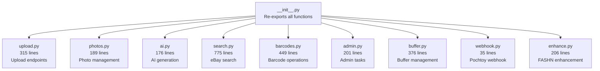

**Backward Compatibility**: All imports from `photos.views` still work!

```python
# Old code still works:
from photos.views import upload_batch, rotate_photo

# Internally, __init__.py re-exports:
from .upload import upload_batch
from .photos import rotate_photo
```

### Service Layer

Централизованный слой для всех внешних API интеграций.

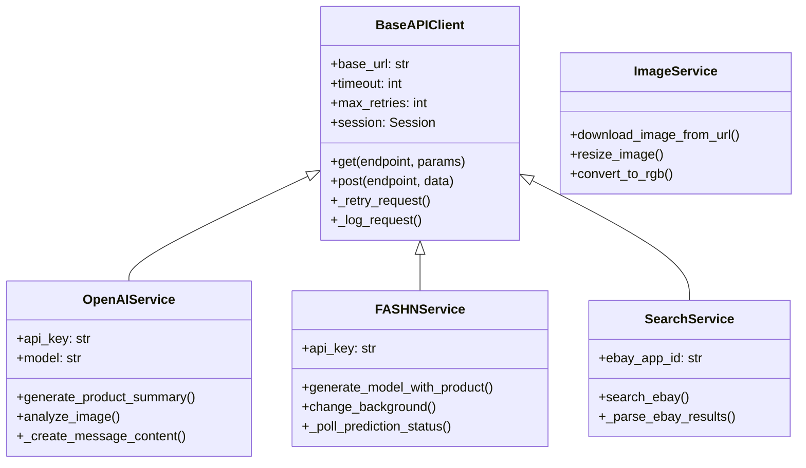

**Benefits:**
- ✅ DRY principle - no duplicate HTTP code
- ✅ Unified retry logic with exponential backoff
- ✅ Consistent error handling
- ✅ Type hints + docstrings
- ✅ Easy to test and mock

### Middleware Pipeline

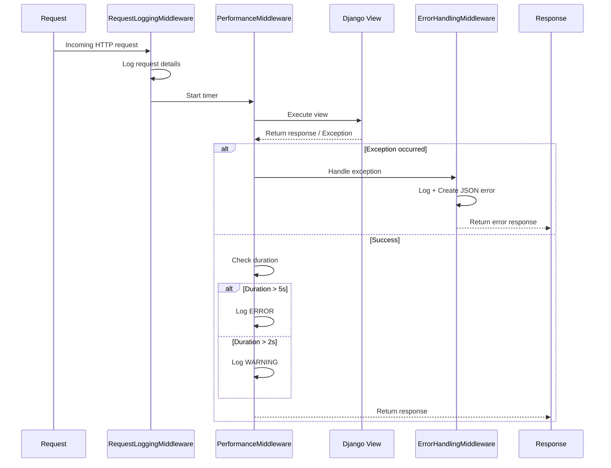

**Middleware Order in `settings.py`:**

```python
MIDDLEWARE = [
    # ... Django built-in middleware ...
    'photos.middleware.request_logging.RequestLoggingMiddleware',  # 1. Log request
    'photos.middleware.performance.PerformanceMonitoringMiddleware',  # 2. Start timer
    'photos.middleware.error_handling.ErrorHandlingMiddleware',  # 3. Catch errors
]
```

### Error Handling Flow

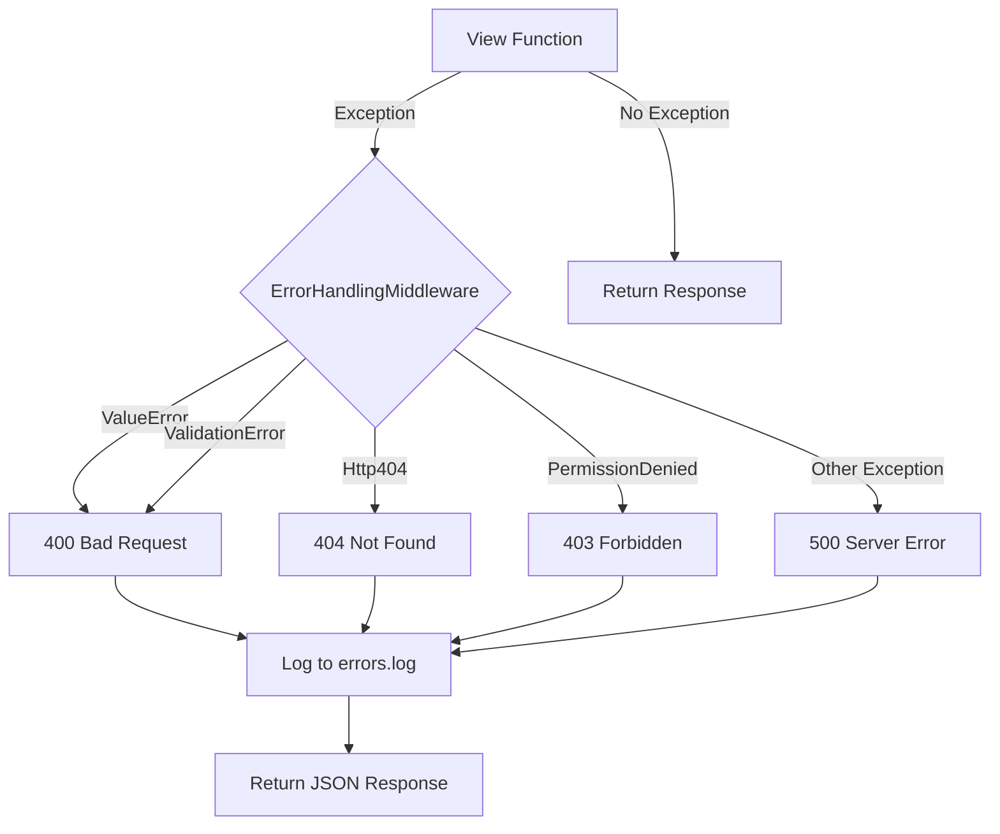

**Error Response Format:**

```json
{
    "success": false,
    "error": "Error type",
    "details": "Detailed error message"
}
```

### Data Models

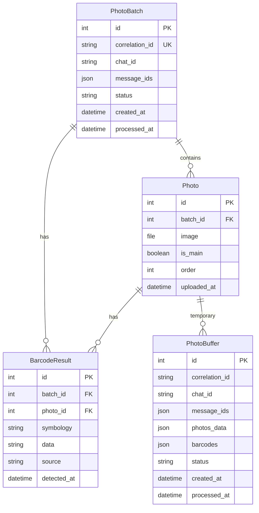

## 🎨 Frontend Architecture

### Alpine.js + Modular JS

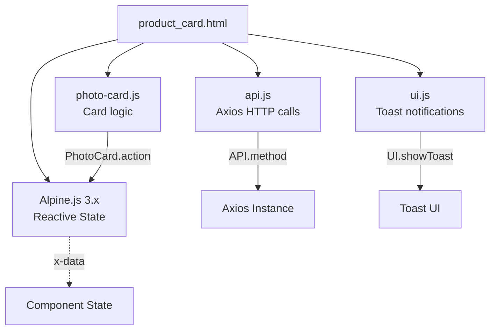

**Files:**
- `api.js` (277 lines) - 15+ API methods with Axios
- `ui.js` (389 lines) - UI utilities, toast notifications
- `photo-card.js` (660 lines) - Card-specific logic

**Before**: ~600 lines inline in template

**After**: Modular, reusable, testable

## 🔐 Security Considerations

### API Keys
- ✅ All keys in environment variables
- ❌ No hardcoded secrets
- ✅ `.env` файл в `.gitignore`

### CSRF Protection
- ✅ Django CSRF middleware enabled
- ✅ `@csrf_exempt` only for API endpoints used by bot
- ✅ Web forms protected with ``

### Input Validation
- ✅ Django form validation
- ✅ Type hints for strong typing
- ✅ Validation in service layer

### Error Handling
- ✅ No traceback in production (unless DEBUG=True)
- ✅ Errors logged to files
- ✅ Generic error messages to users

## 📊 Performance Optimization

### Caching Strategy
- **Current**: No caching (small scale)
- **Future**: Redis for:
  - eBay search results (1 hour)
  - AI-generated summaries (permanent)
  - Session data

### Database Optimization
- ✅ Indexes on: `correlation_id`, `chat_id`, `status`
- ✅ Batch operations where possible
- ✅ `select_related()` for foreign keys

### Image Optimization
- ✅ JPEG compression (quality=90)
- ✅ Resize large images (ImageService)
- ✅ Delete old files on rotation

### API Rate Limiting
- **OpenAI**: 10,000 RPM (tier 1)
- **FASHN**: ~100 requests/day (free tier)
- **eBay**: 5,000 calls/day (standard)

**Strategy**: Background task queue for heavy operations (future)

## 🧪 Testing Strategy

### Unit Tests (Future)
- Service layer (API clients)
- Helper functions
- Decoders

### Integration Tests (Future)
- API endpoints
- Barcode pipeline
- Full workflow

### Manual Testing Checklist
1. ✅ Upload photo via Telegram
2. ✅ Barcode detection works
3. ✅ Create product card in web UI
4. ✅ Generate AI summary
5. ✅ Search eBay
6. ✅ Enhance photo with FASHN
7. ✅ Rotate/delete photos
8. ✅ Export to Pochtoy

## 🚀 Deployment Architecture

### Development
```
├── SQLite database
├── Django runserver
├── Telegram bot (python telegram_bot.py)
└── Local file storage
```

### Production (Recommended)
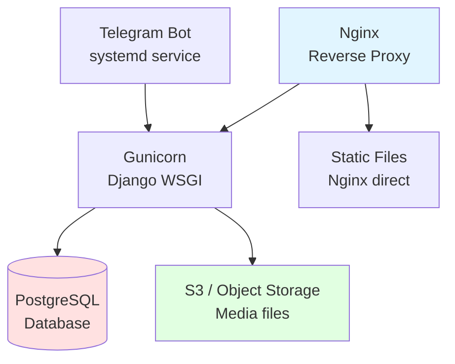

**Production Checklist:**
- [ ] PostgreSQL instead of SQLite
- [ ] Gunicorn/uWSGI for Django
- [ ] Nginx for static files + reverse proxy
- [ ] systemd service for bot
- [ ] S3 for media storage
- [ ] Environment variables via systemd
- [ ] SSL/TLS certificates
- [ ] Log rotation configured
- [ ] Backup strategy

## 📈 Scalability Considerations

### Current Limitations
- Single bot instance
- Single Django instance
- SQLite database
- Local file storage

### Horizontal Scaling (Future)
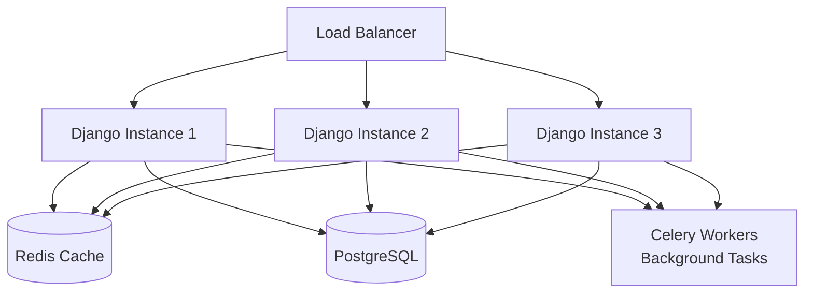

**When to Scale:**
- More than 1000 users
- More than 100 concurrent requests
- Heavy AI processing load

## 🔍 Monitoring & Observability

### Current Implementation
- ✅ Structured logging (3 files)
- ✅ Performance monitoring (slow requests)
- ✅ Error tracking (exceptions logged)
- ✅ Request logging

### Future Improvements
- [ ] **Prometheus** metrics
- [ ] **Grafana** dashboards
- [ ] **Sentry** error tracking
- [ ] **APM** (Application Performance Monitoring)

### Key Metrics to Track
1. **Request rate** (requests/second)
2. **Response time** (p50, p95, p99)
3. **Error rate** (errors/total requests)
4. **AI API success rate**
5. **Bot uptime**
6. **Database query time**

## 📚 Further Reading

- [Django Best Practices](https://docs.djangoproject.com/en/4.2/)
- [python-telegram-bot Documentation](https://docs.python-telegram-bot.org/)
- [Alpine.js Guide](https://alpinejs.dev/)
- [OpenAI API Documentation](https://platform.openai.com/docs/)
- [FASHN AI Documentation](https://docs.fashn.ai/)

---

**Last Updated**: January 2025
**Version**: 2.0 (Post-Refactoring)
