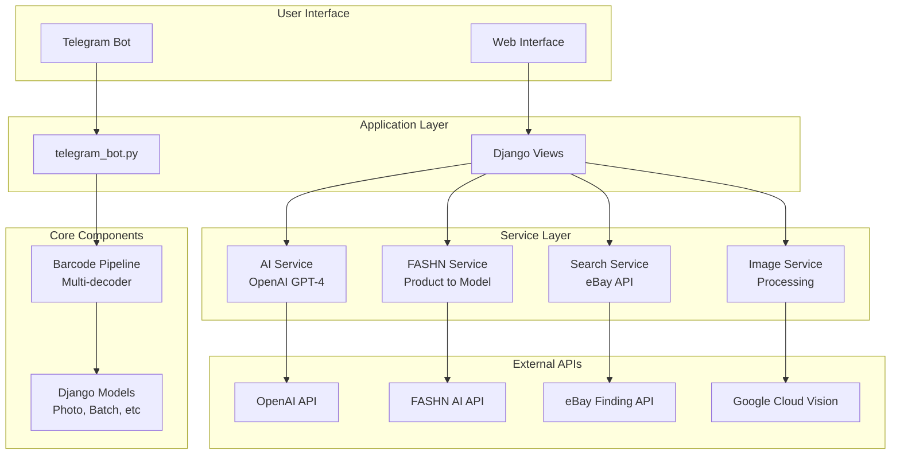
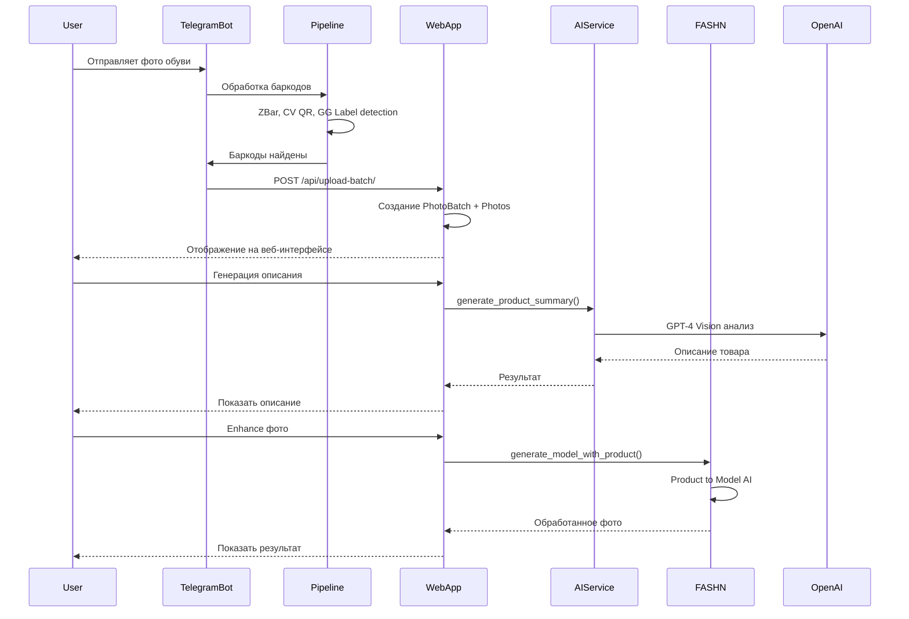

# ShoesBot Documentation

Документация для проекта ShoesBot - системы обработки фотографий обуви с Telegram ботом и Django веб-приложением.

## 📚 Содержание

1. [**Архитектура**](ARCHITECTURE.md) - Подробное описание архитектуры проекта
2. [**Установка и Настройка**](SETUP.md) - Инструкции по установке и запуску
3. [**API Документация**](API.md) - Описание всех API endpoints
4. [**Решение Проблем**](TROUBLESHOOTING.md) - Частые проблемы и их решения

## 🏗️ Архитектура Системы



## 📊 Структура Проекта

```
shoesbot/
├── shoesbot/                   # Telegram Bot + Barcode Processing
│   ├── telegram_bot.py         # Main bot logic
│   ├── config.py               # Bot configuration
│   ├── helpers.py              # Reusable utilities
│   ├── message_sender.py       # Centralized messaging
│   ├── pipeline.py             # Barcode detection pipeline
│   └── decoders/               # Multiple barcode decoders
│       ├── zbar_decoder.py
│       ├── cv_qr_decoder.py
│       ├── gg_label_decoder_improved.py
│       └── ...
│
├── shoessite/                  # Django Web Application
│   ├── photos/                 # Main app
│   │   ├── models.py           # Database models
│   │   ├── views/              # Modular views (10 modules)
│   │   │   ├── upload.py       # Upload endpoints
│   │   │   ├── photos.py       # Photo management
│   │   │   ├── ai.py           # AI generation
│   │   │   ├── search.py       # eBay search
│   │   │   ├── barcodes.py     # Barcode ops
│   │   │   ├── enhance.py      # FASHN enhancement
│   │   │   └── ...
│   │   ├── services/           # Service layer
│   │   │   ├── api_client.py   # Base API client
│   │   │   ├── ai_service.py   # OpenAI integration
│   │   │   ├── fashn_service.py # FASHN integration
│   │   │   ├── search_service.py # eBay integration
│   │   │   └── image_service.py # Image processing
│   │   ├── middleware/         # Custom middleware
│   │   │   ├── request_logging.py
│   │   │   ├── error_handling.py
│   │   │   └── performance.py
│   │   └── utils/
│   │       └── error_handlers.py # Error response utilities
│   └── shoessite/
│       └── settings.py         # Django settings
│
└── docs/                       # Documentation
    ├── README.md               # This file
    ├── ARCHITECTURE.md
    ├── SETUP.md
    ├── API.md
    └── TROUBLESHOOTING.md
```

## 🔄 Workflow Диаграмма



## 🚀 Быстрый Старт

### 1. Установка

```bash
# Клонируем репозиторий
git clone <repo-url>
cd shoesbot

# Устанавливаем зависимости
pip install -r requirements.txt

# Настраиваем переменные окружения
cp .env.example .env
nano .env  # Добавляем API ключи
```

### 2. Запуск Django

```bash
cd shoessite
python manage.py migrate
python manage.py runserver
```

### 3. Запуск Telegram Bot

```bash
cd shoesbot
python telegram_bot.py
```

Подробные инструкции: [SETUP.md](SETUP.md)

## 🔑 Основные Возможности

### Telegram Bot
- ✅ Прием фотографий от пользователей
- ✅ Автоматическое обнаружение баркодов (13+ типов)
- ✅ Специальная обработка GG+Q желтых лейблов
- ✅ Буферизация фото (3 секунды)
- ✅ Отправка в веб-приложение
- ✅ Memory leak protection (TTL cleanup)

### Web Application
- ✅ Просмотр и управление карточками товаров
- ✅ AI-генерация описаний (GPT-4 Vision)
- ✅ Поиск похожих товаров на eBay
- ✅ Обработка фото через FASHN AI (Product to Model)
- ✅ Ручное добавление/редактирование баркодов
- ✅ Ротация, удаление, изменение порядка фото
- ✅ Экспорт в Pochtoy

### Infrastructure
- ✅ Middleware для логирования запросов
- ✅ Performance monitoring (slow requests)
- ✅ Centralized error handling
- ✅ Rotating file logs (10MB limit)
- ✅ Type hints + docstrings везде

## 📈 Метрики Рефакторинга

### До рефакторинга:
- `views.py`: 2758 строк
- Дублирование кода: ~1000+ строк
- AI интеграции: Разбросаны по коду
- Error handling: Повторяющиеся try-except блоки
- Logging: Минимальное

### После рефакторинга:
- `views/`: 10 модулей по ~200 строк
- Services layer: Переиспользуемые компоненты
- Middleware: Централизованная обработка
- Error handling: Утилиты + декоратор
- Logging: Структурированное, 3 файла

**Результат:**
- ✅ -1,354 строк дублирования
- ✅ +2,867 строк чистого кода
- ✅ 100% type hints в сервисах
- ✅ Лучшая архитектура

## 🛠️ Технологии

### Backend
- **Python 3.9+**
- **Django 4.2** - Web framework
- **python-telegram-bot** - Telegram bot API
- **SQLite** - Database (можно заменить на PostgreSQL)

### AI & External APIs
- **OpenAI GPT-4 Vision** - AI описания
- **FASHN AI** - Product to Model generation
- **Google Cloud Vision** - OCR (опционально)
- **eBay Finding API** - Поиск товаров

### Barcode Detection
- **pyzbar** - ZBar library (13 типов баркодов)
- **OpenCV** - QR code detection
- **Custom decoders** - GG Label detection

### Frontend
- **Alpine.js 3.x** - Reactive framework (15KB)
- **Axios** - HTTP client
- **Vanilla JS** - Modular structure

## 📞 Support

Если возникли проблемы, проверьте:
1. [TROUBLESHOOTING.md](TROUBLESHOOTING.md) - Частые проблемы
2. Логи приложения в `shoessite/logs/`
3. Django debug toolbar (если DEBUG=True)

## 📝 Changelog

### v2.0 (Январь 2025) - Полный рефакторинг
- ✅ Service layer для всех внешних API
- ✅ Modular views structure (10 модулей)
- ✅ Custom middleware (logging, performance, errors)
- ✅ Error handling utilities
- ✅ Frontend модули (Alpine.js + Axios)
- ✅ Bot refactoring (config, helpers, MessageSender)
- ✅ Improved GG+Q label detection
- ✅ Comprehensive documentation

### v1.x - Initial version
- Basic functionality
- Monolithic structure
